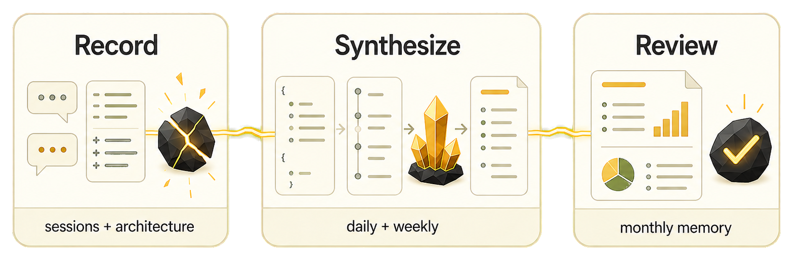

<p align="center">
  
</p>

<h1 align="center">Lode</h1>

<p align="center"><strong>面向 AI 编程工作流的开发记忆系统。</strong></p>
<p align="center">Developer workflow memory for AI-assisted engineering work.</p>
<p align="center"><a href="README.en.md">English README</a></p>

Lode 用来保存那些经常消失在聊天记录里的开发记忆：意图、决策、风险、架构信号，以及每次改动背后的推理。Git 记录 **what changed**，issue tracker 记录 **planned work**，Lode 记录 **开发者和 AI 在实现过程中共同弄明白了什么**，再把这些记忆复用到日报、周报、月报和架构材料里。

Lode 这个名字来自英文里的 lode：矿脉，矿物在地下富集的地方。commits、sessions、diffs、code changes 是原矿，Lode 把它们提炼成值得长期保存的工作知识。

<p align="center">
  
</p>

## 10 分钟跑通闭环

```bash
# 1. 安装 skills
npx skills add KKenny0/Lode -g --all

# 2. 配置知识库路径
mkdir -p ~/.lode
cat > ~/.lode/config.yaml <<EOF
knowledge_vault: /path/to/your/knowledge-vault
EOF

# 3. 验证
npx @lode/cli doctor
```

然后：

1. 在任意 git repo 里正常开发。
2. 一次工作结束时，对 Claude Code 说：`收工`。
3. 一周结束时，说：`写本周周报`。

不配置 `projects.json` 也可以开始。Lode 会使用当前 repo 推导项目 slug，并把结构化 raw entries 写入 vault。

## 适合谁

Lode 适合：

- 同时维护多个 repo 或长期工程项目的人。
- 使用 AI assistant 做实现、调试、重构、文档的人。
- 需要周报、月报、绩效材料、项目复盘材料的人。
- 需要长期保存设计决策、权衡、风险和架构上下文的人。

Lode 不适合：

- 不使用 git 的工作流。
- 不想维护本地 knowledge vault 的人。
- 只需要 issue tracker 或 release-note generator 的人。
- 从不写日报、周报、复盘或项目总结的人。

## 五个 Skills

| Skill | 用途 | 触发时机 |
|---|---|---|
| `lode-session-recap` | 会话结束时提取变更信号 | 每次收工 |
| `lode-arch-doc` | Stage 实现文档 + Pipeline 架构文档 | 架构工作之后 |
| `lode-git-daily-note` | 从 raw entries 和 git history 更新 Obsidian 日报 | 每天按需 |
| `lode-weekly-outline` | raw-first 多项目周报/PPT 大纲 | 每周按需 |
| `lode-monthly-review` | 从 Daily Note 生成月度回顾 | 每月按需 |

这些 skills 是独立的。Lode 不是一个强制流水线；每个 skill 都可以单独触发，只是它们共享同一套本地存储约定，所以后续报告可以复用之前沉淀的上下文。

## 数据模型

knowledge vault 分为两层：

```text
{vault}/
  raw/                            # Raw layer: 结构化中间数据
    projects.json                 # 可选项目注册表
    weeks/
      2026-W18/
        storyboard-pipeline.json  # Raw change entries
    months/
      2026-04/
        signals.json
        skeleton.json
  Daily Note.md                   # Wiki layer: 人类可读笔记
  Work Diary/
    Weekly/
      2026-W18.md
    Monthly/
      2026-04.md
      2026-04.summary.md
```

复用关系：

```text
开发过程中:
  lode-session-recap -> {vault}/raw/weeks/{week}/{slug}.json
  lode-arch-doc      -> {vault}/raw/weeks/{week}/{slug}.json

每天:
  lode-git-daily-note <- raw entries + git log -> {vault}/Daily Note.md

每周:
  lode-weekly-outline <- raw entries + fallback git coverage -> weekly outline

每月:
  lode-monthly-review <- Daily Note.md -> monthly archive + summary
```

## 配置

所有 skills 使用同一份 YAML 配置：

```yaml
# ~/.lode/config.yaml 或 {project}/.lode/config.yaml
knowledge_vault: /path/to/your/knowledge-vault
```

解析优先级：

1. 项目级 `.lode/config.yaml`
2. 全局 `~/.lode/config.yaml`
3. `$WEEKLY_PPT_PATH`
4. `~/.weekly-ppt/`

`$WEEKLY_PPT_PATH` 和 `~/.weekly-ppt/` 是 legacy fallback。新配置应使用 `knowledge_vault`。

安装后运行诊断：

```bash
lode doctor
```

`lode doctor` 会检查配置解析、vault 是否可写、skill 是否已安装、project slug 是否可推导、临时 raw entry 写入、weekly output 目录创建。

## 隐私模型

Lode 只写本地 Markdown 和 JSON 文件。它不引入远程服务、账号、同步后端或托管数据库。如果你的 knowledge vault 是 git repo，是否 push、push 到哪里都由你控制。

但你的 AI runtime 仍然会看到你要求它处理的上下文。不要让 Lode skills 记录 secrets、credentials、客户私有数据，或任何不应该出现在本地 vault 里的内容。

## 示例

合成示例放在 [`examples/`](examples/)。这些示例使用虚构项目 `storyboard-pipeline`，可以安全公开：

- [`examples/raw-entry.json`](examples/raw-entry.json)：高质量 raw entry 示例
- [`examples/projects.json`](examples/projects.json)：可选项目注册表
- [`examples/Daily Note.md`](<examples/Daily Note.md>)：日报片段
- [`examples/weekly-outline.md`](examples/weekly-outline.md)：周报大纲示例
- [`examples/monthly-summary.md`](examples/monthly-summary.md)：月度总结示例
- [`examples/architecture-doc.md`](examples/architecture-doc.md)：Stage/Pipeline 文档片段
- [`examples/vault/`](examples/vault/)：端到端合成 vault 目录结构

## 安装

### skills CLI（推荐）

```bash
# 安装全部 Lode skills（全局，推荐）
npx skills add KKenny0/Lode -g --all

# 安装单个 skill
npx skills add KKenny0/Lode -g --skill lode-session-recap

# 安装多个指定 skill
npx skills add KKenny0/Lode -g --skill lode-session-recap --skill lode-git-daily-note

# 查看可安装的 skills
npx skills add KKenny0/Lode -l

# 安装到指定 agent（如 claude-code、codex）
npx skills add KKenny0/Lode -g -a claude-code --all
```

**参数说明：**

| 参数 | 作用 |
| --- | --- |
| `-g` | 全局安装到 `~/<agent>/skills/`（推荐）。不加则装到当前项目 `./<agent>/skills/` |
| `--skill <name>` | 指定安装某个 skill，可重复使用 |
| `--all` | 安装仓库内全部 skills |
| `-a <agent>` | 指定目标 agent（如 `claude-code`、`codex`、`cursor`） |
| `-l` | 仅列出可用 skills，不安装 |

安装 skills 后，配置知识库路径：

```bash
mkdir -p ~/.lode
cat > ~/.lode/config.yaml <<EOF
knowledge_vault: /path/to/your/knowledge-vault
EOF
```

然后运行诊断验证：

```bash
npx @lode/cli doctor
```

### 替代方式：git clone

```bash
git clone https://github.com/KKenny0/Lode.git ~/.claude/plugins/Lode
```

### 源码安装（开发用）

```bash
npm --prefix cli install
npm --prefix cli run build
npm --prefix cli run copy-skills
node cli/dist/index.js setup
node cli/dist/index.js doctor
```

## 开发

常用命令：

```bash
npm --prefix cli run build
npm --prefix cli run copy-skills
npm --prefix cli run check-skills
```

设计原则：

- **Self-contained skills**：每个 skill 自带 references，可以独立安装。
- **Raw-first reporting**：周报以 raw entries 作为主要语义来源，git 只做 fallback 和 coverage evidence。
- **Graceful side effects**：raw write 如果只是副作用，失败时不阻塞主要产物。
- **Deterministic helpers**：路径解析、日期计算、解析和聚合交给脚本处理。
- **Local evals, public protocols**：本地 fixtures 保持 ignored，公开 benchmark 只保留协议和质量标准。

## Benchmarks

公开 benchmark protocol 只描述质量标准，不发布本地 fixtures：

- [`benchmarks/README.md`](benchmarks/README.md)
- [`benchmarks/weekly-outline.md`](benchmarks/weekly-outline.md)

## License

MIT
